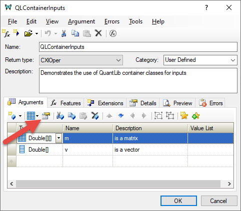
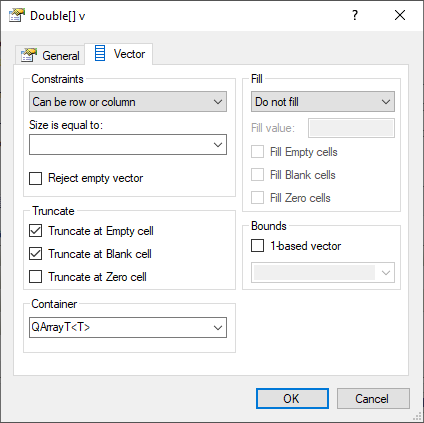
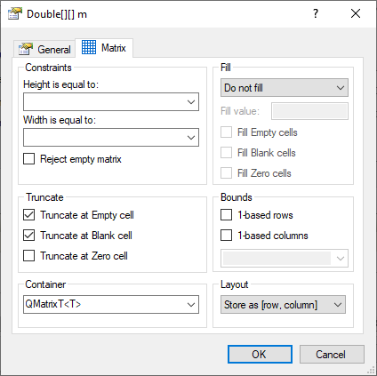

# QL_Containers

This sample project shows how to use [QuantLib](https://www.quantlib.org) container adapters with [XLL Plus](https://planatechsolutions.com/xllplus).

## Requirements

- Boost library (tested with boost_1_75_0)
- QuantLib library, with the Release (static runtime) and Debug (static runtime) configurations built (tested with version 1.24).
- Visual Studio 2019 (any edition)
- XLL PLus for Visual Studio 2019

QuantLib was installed using these helpful instructions - <https://gist.github.com/flcong/dffbc0cbc3c1c0d05efcf04cf4425820>.

## Setting up the project

1.  Add the Boost and QuantLib include folders to the list in **VC++ Directories > Include Directories**.
1.  Add the Boost stage/lib and the QuantLib lib folders to the list in **VC++ Directories > Library Directories**.
1.  `#include` the header file `ql_adapter.h` in the main C++ source file.
1.  Link to the static version of the QuantLib library. 
This will be handled automatically by a `#pragma` in the header file.

> Note: You can stop automatic linking by defining `QL_ADAPTER_NOLIB` 
in the project's compiler flags, which will suppress the following code in `ql_adapter.h`:
>```
>#ifndef QL_ADAPTER_NOLIB
>#ifdef _DEBUG
>#pragma comment(lib, "QuantLib-mt-sgd.lib")
>#else
>#pragma comment(lib, "QuantLib-mt-s.lib")
>#endif
>#endif
>```

## Creating input arguments

1.  Select the argument in the ***XLL+ Function Wizard***.
1.  Press the `Details` button (or press `Alt+Enter`).  

1.  For a vector input, select the `Vector` tab and enter `QArrayT<T>`.  

1.  For a matrix input, select the `Matrix` tab and enter `QMatrixT<T>`.  


## Generated code 

```C++
CXlOper* QLContainerInputs_Impl(CXlOper& xloResult, const CXlOper* m_op, const 
    CXlOper* v_op)
{
    // Input buffers
    QMatrixT<double> m;
    QArrayT<double> v;
    // Validate and translate inputs
    XlReadMatrix(*m_op, mtx_adapter(m), L"m", XLA_TRUNC_ONEMPTY|
        XLA_TRUNC_ONBLANK);
    XlReadVector(*v_op, v, L"v", XLA_TRUNC_ONEMPTY|XLA_TRUNC_ONBLANK);
    // End of generated code
//}}XLP_SRC

    // Use m & v wherever QuantLib::Matrix and QuantLib::Array can be used:
    if ((m.rows() != m.columns()) || (m.rows() != v.size())) {
        throw CXlRuntimeException("Expected m to be "
            "square and the same size as v");
    }
    v *= m.diagonal();

    // Return an Array or Matrix via mtx_adapter(...)
    xloResult = mtx_adapter(v);
    return xloResult.Ret();
}
```

A local variable of type `QArrayT<T>` (for a vector input) or 
`QMatrixT<T>` (for a matrix input) will be created. 
Since these classes are derived from `QuantLib::Array` and `QuantLib::Matrix` 
respectively, they can be used wherever `QuantLib::Array` or `QuantLib::Matrix` 
are expected.

For example, in the code above, `v` is multiplied by the diagonal of `m` if the 
two variables fit.

## Returning QuantLib containers to Excel

To return a container to Excel, use the `mtx_adapter(...)` functions, which 
works with `QuantLib::Matrix`, `QMatrixT<T>`, `QuantLib::Array` & `QArrayT<T>`.
```C++
// Create and populate a QuantLib Array
QuantLib::Array a((QuantLib::Size)size, start, inc);

// Return the Array to Excel
xloResult = mtx_adapter(a);
return xloResult.Ret();
```

```C++
// Populate a QuantLib Matrix
QuantLib::Matrix m(rows, cols, data.begin(), data.end());

// Return the matrix
xloResult = mtx_adapter(m);
return xloResult.Ret();
```

## See also

For more information about QuantLib, visit <https://www.quantlib.org/>.

For more information about XLL Plus, refer to <https://planatechsolutions.com/xllplus>.

---

XLL Plus is a commercial product, requiring a valid paid-for license for commercial use.

To acquire a limited-time free trial, please download a trial version of XLL Plus from 
https://www.planatechsolutionscom/xllplus/download.htm.

To acquire a license for commercial usage, please refer to http://www.planatechsolutions.com/store/.

Copyright &copy; Planatech Solutions Ltd, 2021. All rights reserved. All trademarks are the properties of their respective owners.
